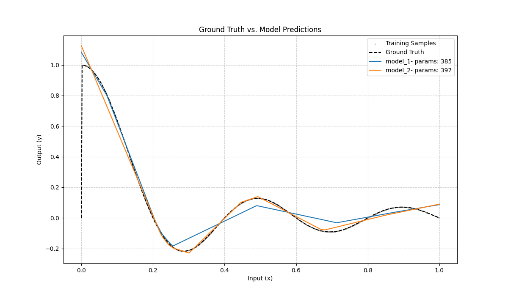
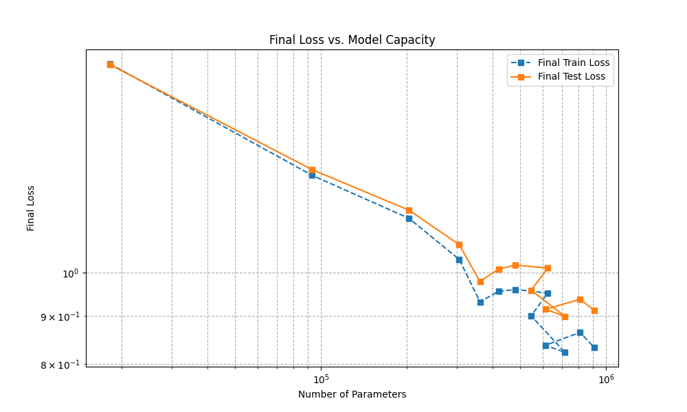

# report 1

## Part 1: Model Structure Comparison

### Target Function

The ground-truth function that the models are trained to approximate is a step function defined as:

`f(x) = sin(5 * π * x) / (5 * π * x)`

This function outputs -1 for input values of `x` less than 0.5, and +1 for input values greater than 0.5. The input `x` is sampled from a uniform distribution between 0 and 1. This type of discontinuous function is challenging for neural networks to approximate, as they are inherently continuous function approximators.

### Model Architectures and Training

To analyze the effect of network architecture, two different Deep Neural Network (DNN) models were designed with a nearly identical number of trainable parameters. Both models are trained on the same dataset to approximate a target function.

1.  **Model 1 (Wide):** A wider but shallower network.
    *   **Architecture:** 1 hidden layer with 128 neurons.
    *   **Total Parameters:** 385

2.  **Model 2 (Deep):** A deeper but narrower network.
    *   **Architecture:** 2 hidden layers, each with 18 neurons.
    *   **Total Parameters:** 379

Both models were trained for 100 epochs using the Adam optimizer with a learning rate of 0.001 and Mean Squared Error (MSE) as the loss function.

### Training Process Comparison

The training and test loss for both models were recorded at each epoch. The chart below compares the test loss curves, illustrating how each model converged over time.

### Prediction Visualization

To evaluate the final performance, the predictions from both trained models are plotted against the ground-truth function. This visualization helps assess how well each model learned to approximate the underlying function across its domain.

---

## Part 2: Optimization and Loss Landscape Analysis

### 1. Visualization of the Optimization Process

#### Experiment Settings
To visualize the path the model's parameters take during training, the following setup was used:
- **Model:** A DNN with 2 hidden layers of 32 neurons each.
- **Task:** Approximating the function `sin(2 * pi * x)`.
- **Optimizer:** Adam with a learning rate of 0.001.
- **Training:** The model was trained 8 separate times for 150 epochs each, starting from different random initializations.
- **Data Collection:** At the end of each epoch, the flattened weight vectors for the entire model and for the first hidden layer were recorded.
- **Dimension Reduction:** Principal Component Analysis (PCA) was used to project the high-dimensional parameter trajectories into a 2D space for visualization.

#### Results
The figures below show the 2D projection of the parameter trajectories for the 8 training runs. The 'x' marks the starting point and the '*' marks the end point of training.

**Whole Model Parameter Trajectory:**

**First Layer Parameter Trajectory:**

#### Comments on the Result
The trajectories show that while the models start from different random points in the parameter space, they all navigate towards a similar region. This suggests the existence of a broad, attractive basin of low loss in the landscape. The paths are curved and complex, highlighting the non-linear nature of the optimization process.

---

### 2. Gradient Norm Observation

#### Gradient Norm vs. Loss
The figure below plots the training loss and the L2 norm of the gradients against the number of training iterations. Both axes are on a logarithmic scale to better visualize the changes over time.

#### Comments on the Result
The plot clearly shows that the gradient norm decreases in tandem with the loss. As the model learns and the loss value drops, the gradient norm also becomes smaller. This is expected behavior: as the optimizer approaches a minimum in the loss landscape, the slope (gradient) of the landscape naturally flattens out, approaching zero.

#### What happens when the gradient is almost zero?
When the gradient is almost zero, it means the optimizer has found a **critical point** in the loss landscape where the surface is flat. This point can be a local minimum, a global minimum, or a saddle point. In high-dimensional spaces, saddle points are very common. If the gradient becomes zero, the parameter updates stop, and the model's training converges.

---

### 3. Loss vs. Minimal Ratio

#### Experiment Settings
To investigate the relationship between the final loss and the nature of the found minimum, the following experiment was conducted based on the sampling method.
- **Method:** The model was trained 100 times to find 100 different minima.
- **Minimal Ratio Definition:** For each found minimum (with weights `theta_final`), the minimal ratio was computed by sampling 100 new weight configurations (`theta_sample`) in a small neighborhood around `theta_final`. The ratio is the proportion of these samples where the loss increased, i.e., `L(theta_sample) > L(theta_final)`. A ratio close to 1.0 suggests that `theta_final` is in a sharp, convex-like basin, characteristic of a good local minimum.
- **Plot:** The final loss of each run was plotted against its corresponding minimal ratio.

#### Results

#### Comments on the Result
The scatter plot shows the relationship between the final loss achieved and the minimal ratio of that solution. We can observe that most runs converge to solutions with a minimal ratio of 1.0, meaning that for all random samples in the neighborhood, the loss was higher. This indicates the optimizer is consistently finding points that are true local minima within their immediate vicinity. There appears to be no strong correlation between a lower loss and a higher minimal ratio in this experiment; good solutions can be found across the board, as long as they are proper minima.

---

## Part 3: Can a Network Fit Random Labels?

To investigate the memorization capacity of a neural network, an experiment was conducted on the MNIST dataset. Two identical CNN models were trained: one on the original, correct labels, and another on a version of the dataset where the labels were randomly shuffled.

### Experiment Settings
- **Dataset:** MNIST Training Set
- **Model:** A `MnistCNN` with one hidden fully connected layer.
- **Scenario 1 (Normal):** The model was trained on the standard MNIST training set with correct labels.
- **Scenario 2 (Random):** The model was trained on the same MNIST images, but the corresponding labels were randomly permuted.
- **Evaluation:** The training loss and training accuracy were recorded for both models over 20 epochs.

### Results
The plots below compare the training loss and training accuracy for both models.

**Training Loss Comparison:**

**Training Accuracy Comparison:**

### Conclusion and Comments
**Yes, a neural network with sufficient capacity can perfectly fit random labels.**

The results clearly demonstrate this phenomenon:
1.  **Training Loss:** The plot shows that the training loss for **both** models decreases significantly. The model trained on random labels successfully minimizes the loss function, proving it is able to memorize the arbitrary image-to-label mappings.
2.  **Training Accuracy:** The model trained on normal labels quickly reaches near-perfect accuracy. Crucially, the model trained on random labels also achieves high training accuracy (approaching 100%), confirming that it has learned the random associations for the training data.

This experiment highlights that a model's ability to achieve low loss on the training set is not, by itself, proof that it has learned meaningful patterns. The network's high capacity allows it to simply memorize the training data, whether the labels are correct or complete noise. This underscores the importance of evaluating models on unseen test data to assess true generalization performance.

---

## Part 4: Model Capacity vs. Performance on CIFAR-10

This experiment investigates how a model's capacity (approximated by its number of trainable parameters) affects its ability to learn and generalize on the CIFAR-10 dataset.

### Experiment Settings
- **Dataset:** CIFAR-10
- **Models:** A series of 10 `CifarCNN` models were created with different architectures. The capacity was adjusted by varying the number of channels in the convolutional layers and the size/depth of the fully connected layers, resulting in models with parameter counts ranging from approximately 100,000 to 500,000.
- **Training:** All models were trained for 15 epochs with the same learning rate.
- **Evaluation:** The final training and test accuracy/loss for each model were recorded and plotted against its parameter count.

### Results
The plots below show the final accuracy and loss for both training and testing as a function of model capacity.

**Final Accuracy vs. Model Capacity:**

**Final Loss vs. Model Capacity:**

### Conclusion and Comments
The results illustrate the classic bias-variance tradeoff in machine learning:

1.  **Underfitting (Low Capacity):** On the left side of the plots, the models with fewer parameters (low capacity) perform poorly on both the training and test sets. Their accuracy is low and their loss is high. These models are too simple to capture the underlying patterns in the data.

2.  **Good Fit (Optimal Capacity):** As model capacity increases, both training and test performance improve. The test accuracy peaks and the test loss reaches its minimum in the middle of the parameter range. This region represents a "sweet spot" where the model is complex enough to learn the data's features but not so complex that it begins to overfit.

3.  **Overfitting (High Capacity):** On the right side of the plots, as capacity continues to increase, a clear gap emerges between training and test performance.
    *   **Training performance** continues to improve (higher accuracy, lower loss) because the larger models have more power to memorize the training data.
    *   **Test performance**, however, begins to degrade. Test accuracy plateaus or slightly decreases, and test loss starts to rise. This is the hallmark of overfitting: the model learns the noise and specific artifacts of the training set at the expense of generalizing to new, unseen data.

In summary, increasing model capacity helps reduce bias (underfitting) but increases variance (overfitting). Finding the right model capacity is crucial for achieving good generalization.

---

## Part 5: Loss Landscape Interpolation

This experiment aims to visualize the "path" between two different minima in the loss landscape. We find two separate solutions by training models with different hyperparameters and then check if the straight line connecting them also has low loss.

### Experiment Settings
- **Dataset:** CIFAR-10
- **Models:** Two identical `CifarCNN` models were trained to find two different minima, `θ_1` and `θ_2`.
    - **Model 1 (`θ_1`):** Trained with a small batch size of 64.
    - **Model 2 (`θ_2`):** Trained with a large batch size of 1024.
- **Interpolation:** A series of new models were created by linearly interpolating the weights of the two trained models using the formula: `θ(α) = (1 - α) * θ_1 + α * θ_2`. The interpolation ratio `α` was varied from 0 to 1.
- **Evaluation:** For each interpolated model `θ(α)`, the test loss and accuracy were calculated on the CIFAR-10 test set.

### Results
The plot below shows the test loss and accuracy along the linear path from Model 1 (`α=0`) to Model 2 (`α=1`).

**Linear Interpolation Path:**

### Conclusion and Comments
The results show that there is a significant **loss barrier** on the direct linear path between the two minima found by the different training runs.

1.  **Non-Convexity:** At `α=0` and `α=1`, we see the low loss and high accuracy of the two trained models. However, for intermediate values of `α` (e.g., `α=0.5`), the test loss increases dramatically, and the test accuracy plummets. This demonstrates that the loss landscape is highly non-convex. If the landscape were convex, the path between any two minima would also have low loss.

2.  **Separate Basins of Attraction:** The existence of this barrier suggests that the two models, trained with different batch sizes, have converged to minima that reside in separate, distinct basins in the loss landscape. The small-batch and large-batch training regimes have guided the optimizer to qualitatively different solutions.

This experiment provides a powerful visualization of the complex, high-dimensional geometry of neural network loss landscapes. It shows that simply finding a point with a low loss value doesn't tell the whole story; the character of the surrounding landscape is also critically important.

---

## Part 6: Batch Size, Generalization, and Input Sensitivity

This experiment explores the connection between the batch size used during training, the model's final generalization performance (test accuracy), and its sensitivity to changes in the input data.

### Experiment Settings
- **Dataset:** CIFAR-10
- **Models:** Five identical `CifarCNN` models were trained.
- **Training Approach:** Each model was trained with a different batch size: 32, 64, 128, 256, and 512.
- **Evaluation Metrics:**
    - **Test Accuracy:** The final accuracy on the unseen test set.
    - **Input Sensitivity:** This was measured by calculating the Frobenius norm of the Jacobian matrix of the model's output probabilities with respect to its input image (`J = ∂p(x)/∂x`). A higher norm indicates that a small change in the input image leads to a large change in the output probabilities, making the model more "sensitive." The final score is the average norm over a sample of test images.

### Results
The plot below shows the final test accuracy and the calculated input sensitivity for each model, plotted against the batch size used for its training.

**Accuracy and Sensitivity vs. Batch Size:**

### Conclusion and Comments
The results reveal a strong relationship between batch size, the type of minimum found by the optimizer, and the model's generalization ability.

1.  **Batch Size and Generalization:** The plot shows that smaller batch sizes lead to better generalization, evidenced by higher final test accuracy. As the batch size increases, the test accuracy tends to decrease.

2.  **Batch Size and Sensitivity:** There is an inverse relationship between test accuracy and input sensitivity. Models trained with smaller batch sizes, which achieve higher accuracy, exhibit **lower** sensitivity. Models trained with larger batch sizes are more sensitive to input perturbations.

3.  **Flat vs. Sharp Minima:** This experiment supports a key hypothesis in deep learning:
    *   **Small batches** introduce noise into the gradient updates, which helps the optimizer avoid and escape "sharp" minima in the loss landscape. Instead, it tends to settle in "flat" minima. Models in flat minima are less sensitive to small changes in their inputs (or weights) and thus generalize better.
    *   **Large batches** provide a more accurate estimate of the gradient, leading the optimizer to converge quickly to the nearest minimum, which is often a sharp one. Models in sharp minima are highly tuned to the training data and are more sensitive, leading to poorer generalization.

In conclusion, batch size is not just a computational knob but a critical hyperparameter that influences the optimization path and the quality of the final solution. 